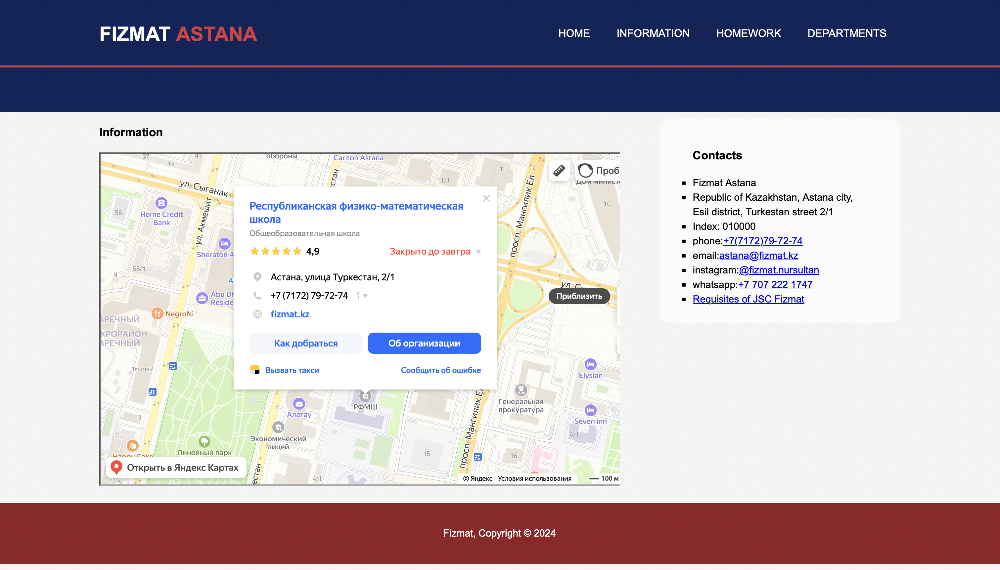
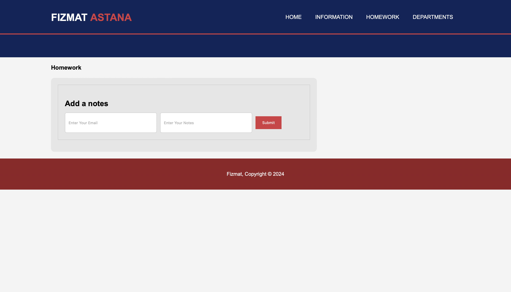
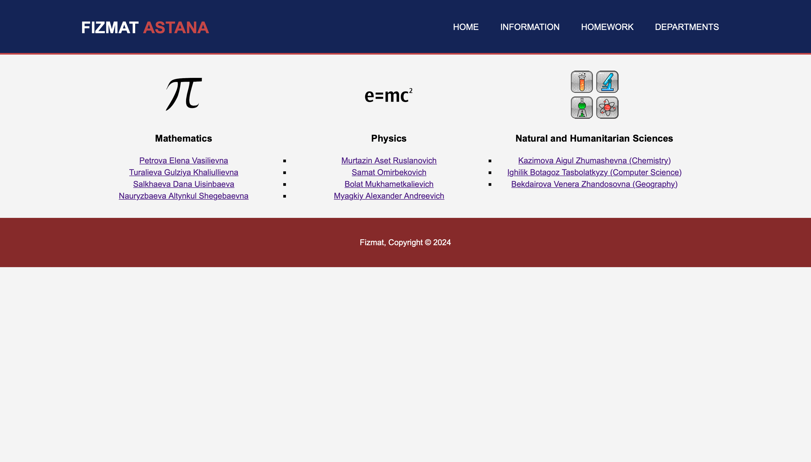
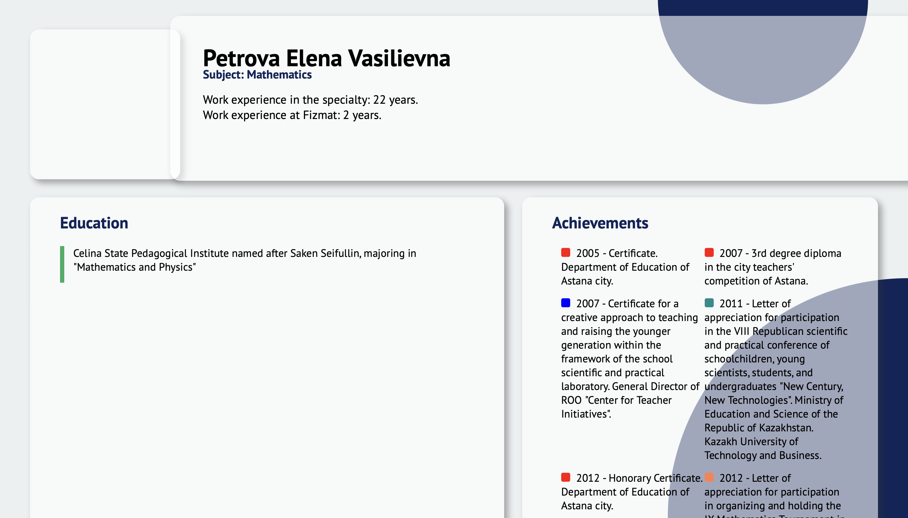
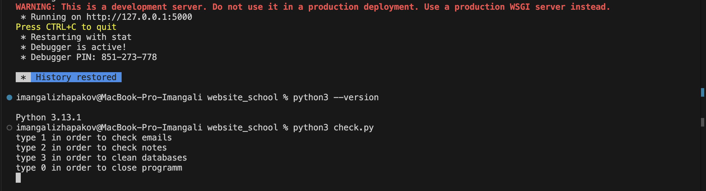

# NSPM School Website
## Project Description

This project was developed to demonstrate proficiency in building fully functional websites integrated with databases. The website draws inspiration from the NSPM school website and is designed to serve prospective school students interested in pursuing secondary education .The website also serves as a simple platform for sending homework answers from students to students. It provides key information, including the school's rating, address, contact details, operating hours, and a comprehensive list of teaching staff.

## Features
The website features four primary sections:
+ Home: A welcoming interface highlighting essential school information.
+ Information: Detailed data on the school's ranking, location, and contact information.
+ Homework: A platform for students to access and manage assignments.
+ Departments: An overview of the school's organizational structure and teaching staff.

Additionally, the website includes two interactive input fields:

1) Feedback Form: Facilitates communication between the school administration and potential applicants.

2) Homewrok Answer Field: Allows students to submit answers for homework

## Instalation
### Prerequisites
Before setting up the project, ensure you have the following installed:
+ Python 3.13.1+: [Download Python](https://www.python.org/downloads/)
+ pip (Python package manager): Comes with Python installation.
+ Git: [Download Git](https://git-scm.com)
+ Web Browser: Any modern browser (e.g., Chrome, Firefox).

### Installation Steps
1) Clone the repository:
    ```bash
    git clone https://github.com/JustImash/website-school.git
2) Navigate to the project directory:
   ```bash
   cd website-school
3) Create a virtual environment:
    ```bash
    python3 -m venv venv
4) Activate the virtual environment:
   + On Windows:
        ```bash
        venv\Scripts\activate
   + On macOS/Linux:
        ```bash
        source venv/bin/activate
5) Install the flask:  
   ```bash
    pip install flask
6) Start the application:
   ```bash
   python3 main.py
7) Open the application in your web browser:
   ```bash
   http://127.0.0.1:5000

## Usage
Once the website is launched, users can freely navigate through the tabs to extract information. On the Home page, users can leave their email address in the provided input field for communication purposes. On the Homework page, users can submit answers to homework assignments.
For database interaction, a custom Python script, check.py, is provided. The script allows you to interact with the database without requiring third-party software. By running the script, users can access the following options:

1) Check Emails: View email addresses submitted through the Home page.

2) Check Notes: Access notes or questions submitted by users.

3) Clear Databases: Reset the database by removing all records.

4) Close Program: Exit the script.

To run the script, execute the following command:

```python3 check.py```

## Screenshots
Homepage:


Information page:


Homework page:


Departments page:


Teacher example page:


check.py:


## Technologies Used

+ Programming Language: Python

+ Frameworks: Flask

+ Database: SQLite

+ Frontend: HTML, CSS

+ Other Tools: Git

## Roadmap

- [X] Integrate a database system to store email addresses and records submitted by students through the platform. Design the database schema to ensure scalability, data integrity, and efficient retrieval. Additionally, create a Python-based script for managing the database
- [ ] Develop and implement a feature that automatically send an email to the specified email address upon submission through the input field located on the 'Home' page. 
- [ ] Develop and implement a system of Student and Teacher classes to enhance the functionality and scalability of the application. The Teacher class should include methods that enable teachers to add homework assignments for students. These assignments will be displayed and managed through the 'Homework' page, providing students with an intuitive platform to access and track their tasks. Additionally, design a database schema to efficiently manage student and teacher records, ensuring seamless interaction and data integrity.

I will be glad for external support and contribution for my project.

## Contributing

Guidelines for contributing to the project:

1. Fork the repository.
2. Create a new branch:
   ```bash
   git checkout -b feature-name
3) Make your changes and commit them:
   ```bash
   git commit -m "Description of changes"
4) Push to your branch:
   ```bash 
   git push origin feature-name
5) Open a pull request.

## License

This project is licensed under the MIT License.

## Contacts
+ Imangali Zhapakov: Imanzhapaqov@gmail.com
+ Project Link: https://github.com/JustImash/website-school
## Acknowledgments

Inspired by the NSPM school website.

Special thanks to all contributors and supporters of this project.